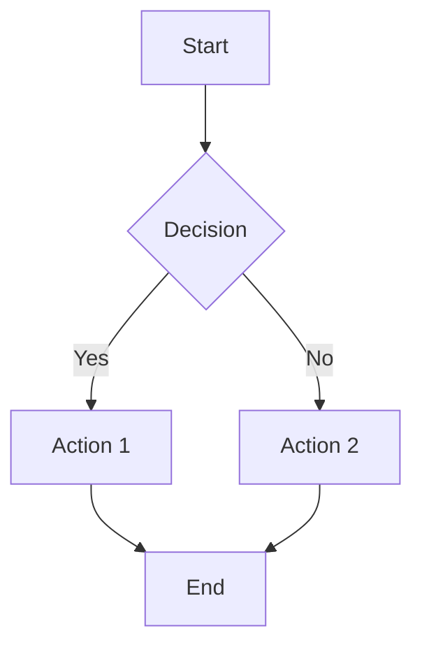
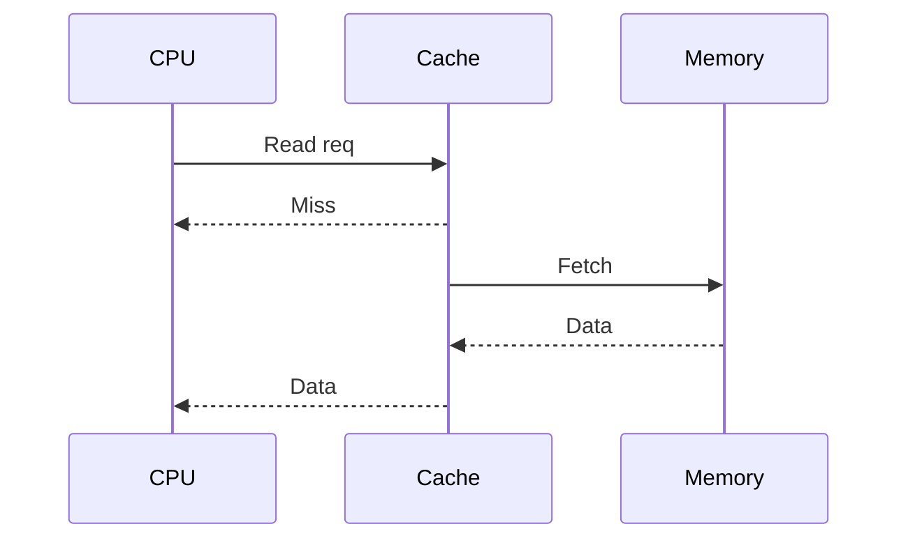
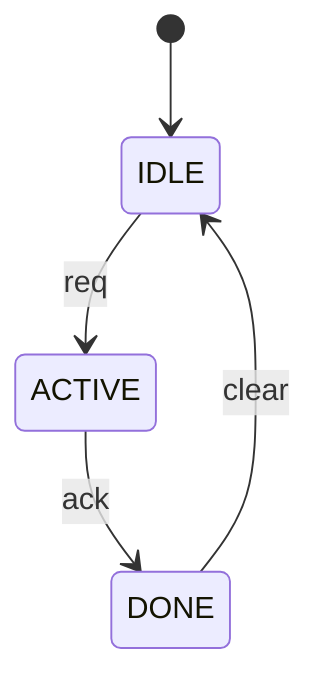

Adapted from ChipSmart (riscv/ChipSmart) diagram-builder.

# Diagram Builder

Generate any diagram format from code analysis. Choose the format that best fits the user's context and rendering environment.

## Format Selection

| User intent | Format | When to use |
|---|---|---|
| Control flow, FSM, data pipeline | `mermaid` — flowchart | Lightweight, widely rendered |
| API calls, protocol handshake, inter-module messages | `mermaid` — sequenceDiagram | Ordered message passing |
| State machine transitions | `mermaid` — stateDiagram-v2 | Explicit FSM states |
| Class hierarchy, module ports | `mermaid` — classDiagram | Structural relationships |
| System block diagram, SoC/chip architecture | `drawio` | Rich layout, documentation-grade |
| Signal waveforms, bus transactions, cycle-accurate timing | `wavedrom` | RTL protocol diagrams |
| Hand-authored vector figure to keep/export (schematic, custom graphic) | `svg` | Arbitrary 2-D geometry; write to a file |
| Block diagram for quick terminal output | ASCII box-drawing | No renderer needed, instant |

If the user specifies a format, use it. If ambiguous, prefer `wavedrom` for
timing, ASCII for a quick inline structural glance, `mermaid` for rich logic/flow.

### How each renders in the interactive TUI (important)

- **`wavedrom`** → rendered INLINE as a real text waveform (the ▦ Waveform
  card). This is the only format drawn as a picture — prefer it for timing.
- **ASCII box-drawing** → shown exactly as written (it *is* the picture).
- **`mermaid` / `drawio` / `svg`** → shown as a labelled SOURCE card
  (readable/copyable), NOT rendered into a picture in the terminal. Use them
  when the source/document is the deliverable; for an at-a-glance inline
  structural view, ASCII is better. Never assume a rendered image is shown to
  you or the user — everything is text.

---

## MANDATORY for Timing and Waveform Diagrams

Before generating any WaveDrom or timing diagram:

1. **Read the ENTIRE target module RTL** with `view` — not just port names
2. Identify whether outputs are **registered** (`always_ff`) or **combinational** (`assign`/`always_comb`)
3. Trace actual pipeline stages, FSM states, and handshake logic from the code
4. **Do NOT assume standard protocol behaviour** — the implementation may differ from the spec (pready may not be hardwired, there may be wait states, etc.)
5. Every signal transition MUST be justified by a specific RTL construct you read

If you cannot access the RTL, state this explicitly and do not generate speculative waveforms.

---

## Mermaid

Output inside a fenced ` ```mermaid ` block. The TUI shows it as a labelled
source card (readable/copyable) — it is not drawn as a picture, so for a quick
inline structural glance ASCII is better; use mermaid for rich logic/flow or a
.md document.

### Flowchart


### Sequence diagram


### State diagram


### Workflow
1. Read source files with `view`
2. For flowcharts — trace `if/else`, `case`, `always_comb` branches
3. For sequence — trace inter-module calls, `valid`/`ready` handshakes
4. For state diagrams — extract FSM states and transitions from `always_ff` / `case(state)` blocks
5. Keep diagrams under 25 nodes for readability; split into sub-diagrams if larger

---

## draw.io

Output inside a fenced ` ```drawio ` block. Use for architecture-level block diagrams.

```drawio
<mxfile>
  <diagram name="Architecture">
    <mxGraphModel>
      <root>
        <mxCell id="0"/>
        <mxCell id="1" parent="0"/>
        <mxCell id="2" value="CPU Core" style="rounded=1;fillColor=#dae8fc;strokeColor=#6c8ebf;" vertex="1" parent="1">
          <mxGeometry x="40" y="40" width="160" height="80" as="geometry"/>
        </mxCell>
        <mxCell id="3" value="L2 Cache" style="rounded=1;fillColor=#d5e8d4;strokeColor=#82b366;" vertex="1" parent="1">
          <mxGeometry x="260" y="40" width="160" height="80" as="geometry"/>
        </mxCell>
        <mxCell id="4" style="endArrow=block;endFill=1;" edge="1" source="2" target="3" parent="1">
          <mxGeometry relative="1" as="geometry"/>
        </mxCell>
      </root>
    </mxGraphModel>
  </diagram>
</mxfile>
```

### Style palette
| Block type | fillColor | strokeColor |
|---|---|---|
| Processing (CPU, core) | `#dae8fc` | `#6c8ebf` |
| Memory (cache, SRAM) | `#d5e8d4` | `#82b366` |
| IO / interface | `#fff2cc` | `#d6b656` |
| Control / config | `#f8cecc` | `#b85450` |
| Bus / interconnect | `#e1d5e7` | `#9673a6` |

### Workflow
1. Identify major blocks (modules, subsystems, IPs)
2. Map connections (buses, signals, APB/AXI interfaces)
3. Assign IDs sequentially from `id="2"` (0 and 1 are reserved root cells)
4. Place inputs left, outputs right; clock/reset as top annotation
5. Add edge labels for bus widths and protocol names

---

## WaveDrom

Output inside a fenced ` ```wavedrom ` block.

### Basic syntax
```wavedrom
{ "signal": [
  { "name": "clk",   "wave": "p........" },
  { "name": "req",   "wave": "0.1..0..." },
  { "name": "ack",   "wave": "0..1.0..." },
  { "name": "data",  "wave": "x..345x..", "data": ["A","B","C"] },
  { "name": "valid", "wave": "0..1..0.." }
]}
```

### Wave character reference
| Char | Meaning |
|---|---|
| `p` / `n` | Clock rising / falling |
| `0` / `1` | Low / high |
| `x` | Unknown / don't care |
| `z` | High-impedance |
| `.` | Continue previous state |
| `2`–`9` | Named data values (use `"data"` array) |
| `|` | Gap / time skip |

### AXI handshake example (read from RTL, then draw)
```wavedrom
{ "signal": [
  { "name": "clk",      "wave": "p........." },
  { "name": "arvalid",  "wave": "0.1...0..." },
  { "name": "arready",  "wave": "0..1..0..." },
  { "name": "rvalid",   "wave": "0....1.0.." },
  { "name": "rready",   "wave": "0....1.0.." },
  { "name": "rdata",    "wave": "x....2.x..", "data": ["DATA"] }
]}
```

### Workflow
1. Read RTL — identify clock, registered vs combinational signals
2. Choose scenario (normal path, back-pressure, error, reset)
3. Pick a realistic cycle count (8–16 cycles for most protocols)
4. Draw each signal wave left-to-right, ensuring every transition maps to a specific RTL event
5. Add `"config": {"hscale": 2}` for wide diagrams

---

## ASCII Block Diagrams

Use for quick terminal output when no renderer is available. Write to a `.md` file — do NOT inline large ASCII diagrams in the chat.

### Conventions
- Outermost module: `╔ ╗ ╚ ╝ ║ ═`
- Sub-blocks: `┌ ┐ └ ┘ │ ─`
- Signal flow: `──►` `◄──` `▲` `▼`
- Signal widths in brackets: `data[31:0]`
- Inputs on left, outputs on right

### Example
```
╔══════════════════════════════════════════════╗
║                  top_module                  ║
║                                              ║
║  clk ──────────────────────────────────────  ║
║  rst_n ─────────────────────────────────────  ║
║                                              ║
║  req ──►┌──────────┐  grant ┌──────────┐    ║
║         │ Arbiter  │───────►│  Output  │──►  ║
║  data──►│          │        │  Mux     │     ║
║         └──────────┘        └──────────┘    ║
╚══════════════════════════════════════════════╝
```

Write the diagram to `<module>_arch.md` using `write`, then report the file path.

---

## SVG

For a hand-authored vector figure the user wants to keep or export (a schematic,
a custom graphic that ASCII/mermaid can't express). Output inside a fenced
` ```svg ` block and normally `write` it to a file (`<name>.svg`), then report
the path — the terminal shows the source as a card, it does not rasterise it.
Use sparingly: prefer `wavedrom` for timing, ASCII/`mermaid` for structure.

```svg
<svg xmlns="http://www.w3.org/2000/svg" width="200" height="80">
  <rect x="10" y="10" width="80" height="40" fill="none" stroke="black"/>
  <text x="50" y="35" text-anchor="middle">DUT</text>
  <line x1="90" y1="30" x2="150" y2="30" stroke="black" marker-end="url(#a)"/>
</svg>
```

---

## Quality Rules (apply to all formats)

- **Read before drawing** — every signal, block, and connection must come from code you read, not assumptions
- **Name signals correctly** — use the actual RTL signal names from the source
- **Show reset** — include `rst_n` or equivalent in timing diagrams
- **Annotate widths** — label bus widths on connections where it aids understanding
- **Stay realistic** — don't show back-to-back transactions if the RTL has pipeline latency
